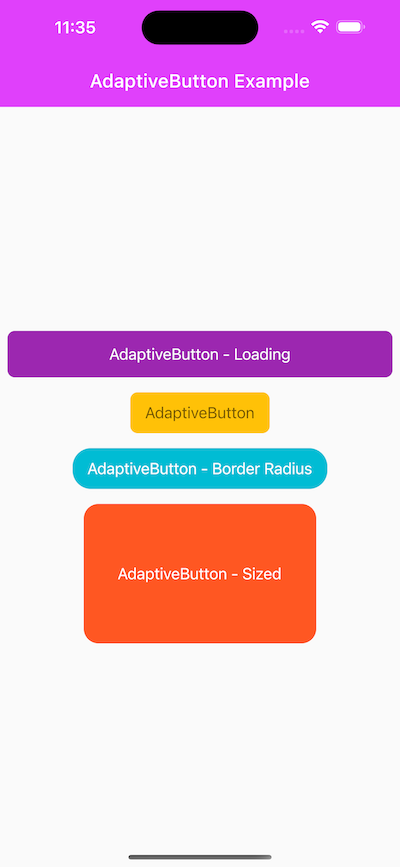

# adaptive_button

Flutter AdaptiveButton

## Getting Started

Import the following package.

```dart
import 'package:adaptive_button/adaptive_button.dart';
```



```dart
@override
Widget build(BuildContext context) {
  return Scaffold(
      body: Container(
        child: AdaptiveButton(
            child: Text("AdaptiveButton"),
            onPressed: () async {}
        ),
      ));
}
```