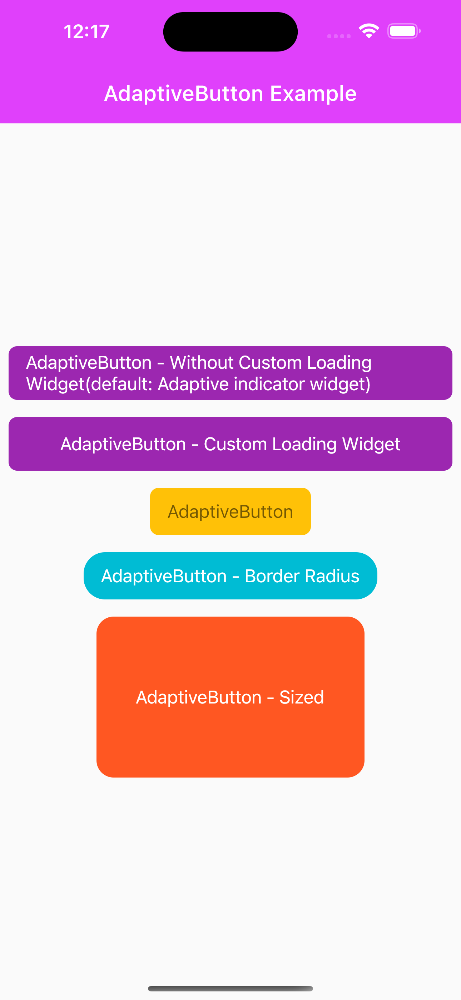

# AdaptiveButton

While AdaptiveButton is compatible with the platform, it disables the clicking feature of the button
for your asynchronous operations and displays a widget on the button while waiting.

## Getting Started

Import the following package.

```dart
import 'package:adaptive_button/adaptive_button.dart';
```




```dart
@override
Widget build(BuildContext context) {
  return Scaffold(
      body: Container(
        child: AdaptiveButton(
            child: Text("AdaptiveButton"),
            onPressed: () async {}
        ),
      ));
}
```

```dart
@override
Widget build(BuildContext context) {
  return Scaffold(
      body: Container(
        child: AdaptiveButton(
          height: 50,
          width: MediaQuery
              .of(context)
              .size
              .width,
          enabledLoading: true,
          child: const Text("AdaptiveButton - Non Loading Widget"),
          onPressed: () async {
            await Future.delayed(const Duration(seconds: 2));
            showDialog(
              context: context,
              builder: (context) {
                return const AlertDialog(
                  content: Text(
                      "Merhaba ben AdaptiveButton bulunduğum platforma göre şekillenirim:)"),
                );
              },
            );
          },
        ),
      ));
}

```

```dart
@override
Widget build(BuildContext context) {
  return Scaffold(
      body: Container(
        child: AdaptiveButton(
          color: Colors.amber,
          child: const Text(
            "AdaptiveButton",
            style: TextStyle(color: Colors.black54),
          ),
          onPressed: () async {
            showDialog(
              context: context,
              builder: (context) {
                return const AlertDialog(
                  content: Text(
                      "Merhaba ben AdaptiveButton bulunduğum platforma göre şekillenirim:)"),
                );
              },
            );
            debugPrint("AdaptiveButton Test Message");
          },
        ),
      ));
}

```

```dart
@override
Widget build(BuildContext context) {
  return Scaffold(
    body: AdaptiveButton(
      height: 50,
      width: MediaQuery
          .of(context)
          .size
          .width,
      enabledLoading: true,
      loadingWidget: const SizedBox(
          width: 20,
          height: 20,
          child: CircularProgressIndicator(
            color: Colors.amber,
          )),
      child: const Text("AdaptiveButton - Loading"),
      onPressed: () async {
        await Future.delayed(const Duration(seconds: 2));
        showDialog(
          context: context,
          builder: (context) {
            return const AlertDialog(
              content: Text(
                  "Merhaba ben AdaptiveButton bulunduğum platforma göre şekillenirim:)"),
            );
          },
        );
      },
    ),);
}

```